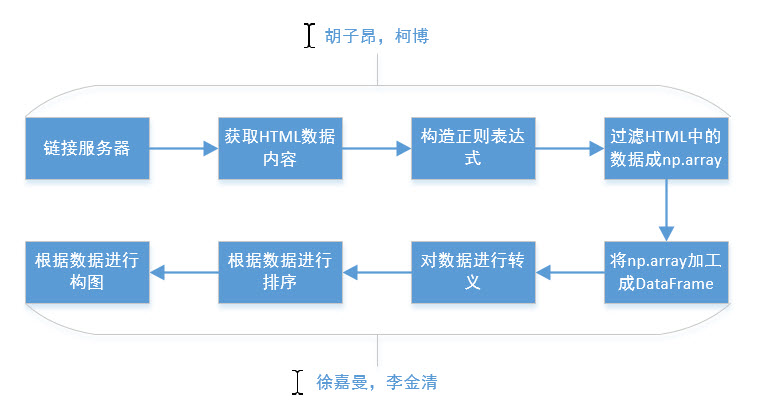

# python_spider
> This is a spider support by python for WizardQuant lab, Guangzhou. </br>
> 创作者：柯博，胡子昂，李金清，徐嘉曼
---
## 流程图


---
## 分工
胡子昂：
 1. 构造正则表达式
 2. 过滤数据转换成np.array
 3. README.md写

柯博：
 1. 连接服务器
 2. 获取HTML数据内容
 3. 用另一种方法将数据转换成np.array

徐嘉曼：
 1. 将数据加工成DataFrame
 2. 对数据进行排序

李金清：
 1. 将数据加工成DataFrame
 2. 对数据进行排序

---

## Usage：
git clone当前仓库，执行ipython main.py即可！结果如图所示（未排序结果）：
```
合约名称        最新价       涨跌     持仓量     成交量         成交金额            买卖价  \
0    ag1802    3760.00   -12.00     216      24      1353750      3755/3767   
1    ag1803    3778.00    -6.00     436      26      1474800      3667/3784   
2    ag1804    3830.00     0.00     148       0            0      3710/3937   
3    ag1805    3821.00    -4.00     628     100      5737230      3812/3850   
4    ag1806    3838.00    -6.00  668780  207686  11966378100      3837/3838   
5    ag1807    3868.00    -2.00     288      20      1161030      3737/4038   
6    ag1808    3888.00    -7.00     214       4       233280      3768/4055   
7    ag1809    3903.00     1.00     376      18      1054650      3790/3927   
8    ag1810    3924.00     6.00     152       2       117720      3799/4042   
9    ag1811    3941.00     1.00      74       2       118230      3746/4001   
10   ag1812    3943.00    -7.00    6682    1758    104143320      3943/3949   
11   ag1901    3997.00     0.00       2       0            0      3900/4040   
12   al1802   14585.00   -60.00  124958   34500   2515208050    14570/14585   
13   al1803   14660.00   -70.00  334574  221918  16288433700    14660/14665   
14   al1804   14755.00   -60.00  173920   79546   5876365600    14750/14755   
15   al1805   14840.00   -60.00  107400   39128   2906473550    14840/14845   
16   al1806   14940.00   -60.00   27288    4232    315922400    14900/14940   
17   al1807   15035.00   -35.00    3494     716     53781600    14970/15035   
18   al1808   15125.00   -40.00    1208      22      1662900    15090/15255   
19   al1809   15180.00   -30.00     592      42      3208100    15080/15475   
20   al1810   15230.00    15.00     502      80      6078250    15155/15650   
21   al1811   15280.00   -65.00     404      18      1373100    15230/15695   
22   al1812   15320.00   -95.00     488      10       768350    15320/15580   
23   al1901   15495.00    55.00      44       0            0    15280/15480   
24   au1802     276.45     0.00     282       2       552900  265.45/276.55   
25   au1803     278.90     0.00       4       0            0  270.40/284.10   
26   au1804     276.40     0.10     268       0            0  267.55/279.95   
27   au1806     278.50    -0.15  274708   91784  25594246000  278.50/278.55   
28   au1808     282.55     0.00      56       0            0        /288.15   
29   au1810     283.40     0.00      34       0            0  279.60/291.25   
..      ...        ...      ...     ...     ...          ...            ...   
131  sn1808  145270.00     0.00       4       0            0        144680/   
132  sn1809  147530.00  1300.00     904     320     47119520  146920/147660   
133  sn1810  147550.00     0.00       2       0            0              /   
134  sn1811  149310.00  2530.00       2       2       298620              /   
135  sn1812  146780.00     0.00       0       0            0              /   
136  sn1901  147300.00     0.00       6       0            0  145120/152500   
137  wr1802    3121.00     0.00       0       0            0              /   
138  wr1803    3121.00     0.00       0       0            0              /   
139  wr1804    3121.00     0.00       0       0            0              /   
140  wr1805    3121.00     0.00       0       0            0              /   
141  wr1806    3121.00     0.00       0       0            0              /   
142  wr1807    3121.00     0.00       0       0            0              /   
143  wr1808    3121.00     0.00       0       0            0              /   
144  wr1809    3121.00     0.00       0       0            0              /   
145  wr1810    3121.00     0.00       0       0            0              /   
146  wr1811    3121.00     0.00       0       0            0              /   
147  wr1812    3121.00     0.00       0       0            0              /   
148  wr1901    3121.00     0.00       0       0            0              /   
149  zn1802   26210.00   220.00   78394   34686   4535057450    26200/26210   
150  zn1803   26210.00   205.00  229078  291540  38140993650    26210/26220   
151  zn1804   26210.00   220.00   91156   61416   8031404900    26210/26215   
152  zn1805   26180.00   225.00   87090   33222   4337081100    26165/26180   
153  zn1806   26090.00   200.00   20270    6392    832625400    26085/26110   
154  zn1807   26060.00   180.00    2084    1004    130624050    26035/26100   
155  zn1808   25970.00   200.00     412      78     10109350    25770/25990   
156  zn1809   25920.00   200.00     760     130     16813850    25700/25920   
157  zn1810   25815.00   185.00     724      28      3609500    25415/25880   
158  zn1811   25710.00   140.00     224      24      3085700    25370/25860   
159  zn1812   25720.00    35.00      84       8      1028050    25590/25760   
160  zn1901   25640.00   145.00      18      14      1795600    25500/25700   

           昨结算         开盘         最低         最高  现手  
0      3772.00    3759.00    3759.00    3762.00   0  
1      3784.00    3780.00    3778.00    3786.00   0  
2      3830.00       0.00       0.00       0.00   0  
3      3825.00    3825.00    3816.00    3834.00   0  
4      3844.00    3841.00    3835.00    3848.00   0  
5      3870.00    3868.00    3860.00    3881.00   0  
6      3895.00    3888.00    3888.00    3888.00   0  
7      3902.00    3907.00    3903.00    3909.00   0  
8      3918.00    3924.00    3924.00    3924.00   0  
9      3940.00    3941.00    3941.00    3941.00   0  
10     3950.00    3944.00    3943.00    3956.00   0  
11     3997.00       0.00       0.00       0.00   0  
12    14645.00   14670.00   14525.00   14690.00   0  
13    14730.00   14760.00   14610.00   14785.00   0  
14    14815.00   14845.00   14705.00   14880.00   0  
15    14900.00   14950.00   14800.00   14965.00   0  
16    15000.00   15045.00   14900.00   15045.00   0  
17    15070.00   15110.00   14980.00   15115.00   0  
18    15165.00   15135.00   15080.00   15160.00   0  
19    15210.00   15490.00   15150.00   15490.00   0  
20    15215.00   15270.00   15140.00   15270.00   0  
21    15345.00   15250.00   15245.00   15280.00   0  
22    15415.00   15380.00   15320.00   15435.00   0  
23    15440.00       0.00       0.00       0.00   0  
24      276.45     276.45     276.45     276.45   0  
25      278.90       0.00       0.00       0.00   0  
26      276.30       0.00       0.00       0.00   0  
27      278.65     278.90     278.45     279.15   0  
28      282.55       0.00       0.00       0.00   0  
29      283.40       0.00       0.00       0.00   0  
..         ...        ...        ...        ...  ..  
131  145270.00       0.00       0.00       0.00   0  
132  146230.00  147110.00  146500.00  147800.00   0  
133  147550.00       0.00       0.00       0.00   0  
134  146780.00  149310.00  149310.00  149310.00   0  
135  146780.00       0.00       0.00       0.00   0  
136  147300.00       0.00       0.00       0.00   0  
137    3121.00       0.00       0.00       0.00   0  
138    3121.00       0.00       0.00       0.00   0  
139    3121.00       0.00       0.00       0.00   0  
140    3121.00       0.00       0.00       0.00   0  
141    3121.00       0.00       0.00       0.00   0  
142    3121.00       0.00       0.00       0.00   0  
143    3121.00       0.00       0.00       0.00   0  
144    3121.00       0.00       0.00       0.00   0  
145    3121.00       0.00       0.00       0.00   0  
146    3121.00       0.00       0.00       0.00   0  
147    3121.00       0.00       0.00       0.00   0  
148    3121.00       0.00       0.00       0.00   0  
149   25990.00   26180.00   26050.00   26230.00   0  
150   26005.00   26200.00   26050.00   26250.00   0  
151   25990.00   26220.00   26040.00   26235.00   0  
152   25955.00   26170.00   26010.00   26200.00   0  
153   25890.00   26100.00   25950.00   26140.00   0  
154   25880.00   26010.00   25925.00   26080.00   0  
155   25770.00   25925.00   25840.00   25975.00   0  
156   25720.00   25940.00   25795.00   25940.00   0  
157   25630.00   26880.00   24635.00   26880.00   0  
158   25570.00   25770.00   25625.00   25770.00   0  
159   25685.00   25645.00   25645.00   25720.00   0  
160   25495.00   25685.00   25630.00   25685.00   0  

[161 rows x 12 columns]
